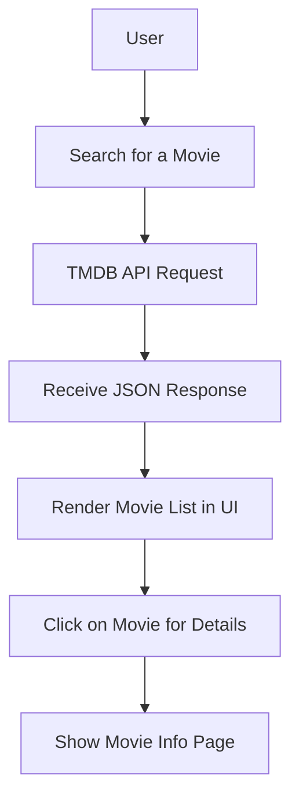

# 🎬 IMDB-Clone

An **IMDB-inspired movie database app** built with React, Tailwind CSS, and Vite.
Powered by the **TMDB API** for real-time movie data.

---

## 📸 Project Preview

"
            "
---

## 🛠️ Tech Stack

* ⚛️ **React** – UI components
* 🎨 **Tailwind CSS** – Styling
* ⚡ **Vite** – Fast bundler
* 🛤️ **React Router** – Navigation
* 🎬 **TMDB API** – Movie database

---

## 🔑 API Setup (TMDB)

1. Create a free account on [TMDB](https://www.themoviedb.org/).
2. Go to **Settings > API** and generate your API key.
3. Create a `.env` file in the project root:

   ```bash
   VITE_TMDB_API_KEY=your_api_key_here
   ```
4. Use the key in your fetch requests. Example:

   ```js
   const API_URL = `https://api.themoviedb.org/3/movie/popular?api_key=${import.meta.env.VITE_TMDB_API_KEY}`;
   ```

---

## 🔄 Project Flow

Here’s a quick flow of how the app works:



---

## 🚀 Getting Started

### 1️⃣ Clone the Repo

```bash
git clone https://github.com/Mukulsharnagat01/IMDB-Clone.git
cd IMDB-Clone
```

### 2️⃣ Install Dependencies

```bash
npm install
```

### 3️⃣ Run the App

```bash
npm run dev
```

---

## 📂 Project Structure

```
IMDB-Clone/
│── public/               # Static assets
│── src/                  # React components & pages
│── my-react-router-app/  # Router setup
│── index.html            # Entry point
│── package.json          # Dependencies & scripts
```

---

## ✨ Features

* 🔍 Search movies by title
* 📖 View detailed movie information
* ⭐ Highlight trending and popular movies
* 📱 Responsive UI
* 🎬 Powered by TMDB API

---

## 🤝 Contributing

Contributions are welcome!

1. Fork the repo
2. Create a new branch (`feature/new-feature`)
3. Commit changes
4. Open a Pull Request

---

## 👨‍💻 Author

**Mukul Sharnagat**
🔗 https://github.com/
